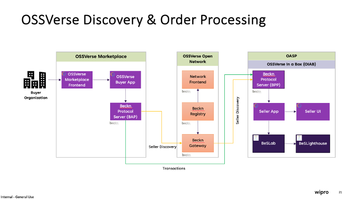
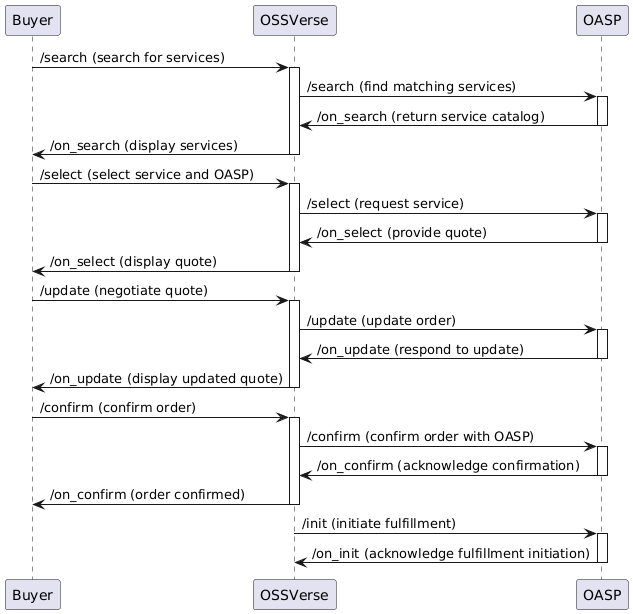

# API Specification

This page provides a summary of the Beckn-based APIs that enable interaction with the OSSVerse platform.

## API Categories

The APIs are categorized based on their function within the OSSVerse workflow:

*   **Discovery:**  For finding and evaluating assurance services and OASPs.
*   **Order:**  For creating, managing, and confirming orders, including subscriptions.
*   **Fulfillment:**  For initiating, tracking, and updating the status of order fulfillment.
*   **Post-Fulfillment:**  For providing feedback, requesting support, and managing subscriptions.

## API Endpoints

| Category | API Endpoint | Description |
|---|---|---|
| Discovery | [`/search`](api/search.md) | Allows buyers to search for OASPs and services. |
|  | [`/on_search`](api/on_search.md) | BPP responds with a catalog of relevant services. |
| Order | [`/select`](api/select.md) | Allows buyers to select an OASP and service package. |
|  | [`/on_select`](api/on_select.md) | OASP responds with a quote or order confirmation. |
|  | [`/update`](api/update.md) | Buyer updates an order or submits a counter-offer. |
|  | [`/on_update`](api/on_update.md) | OASP responds with an updated order or counter-offer. |
|  | [`/confirm`](api/confirm.md) | Buyer confirms a finalized order. |
|  | [`/on_confirm`](api/on_confirm.md) | OASP creates the order. |
|  | [`/cancel`](api/cancel.md) | Buyer requests cancellation of an order. |
|  | [`/on_cancel`](api/on_cancel.md) | OASP cancels the order. |
|  | [`/subscribe`](api/subscribe.md) | Buyer initiates a subscription to a service plan. |
|  | [`/on_subscribe`](api/on_subscribe.md) | OASP confirms/rejects the subscription. |
| Fulfillment | [`/init`](api/init.md) | BPP initiates the fulfillment process. |
|  | [`/on_init`](api/on_init.md) | OASP confirms fulfillment initiation. |
|  | [`/status`](api/status.md) | Buyer requests the status of an order. |
|  | [`/on_status`](api/on_status.md) | OASP provides the order status. |
|  | [`/track`](api/track.md) | Buyer requests tracking information. |
|  | [`/on_track`](api/on_track.md) | OASP provides tracking details. |
| Post-Fulfillment | [`/rating`](api/rating.md) | Buyer submits a rating. |
|  | [`/on_rating`](api/on_rating.md) | BPP acknowledges the rating. |
|  | [`/support`](api/support.md) | Buyer requests support. |
|  | [`/on_support`](api/on_support.md) | OASP provides support information. |

##  Understanding the OSSVerse Architecture

### High-Level Architecture Diagram

  

This diagram illustrates the key components and interactions within the OSSVerse ecosystem, including the Buyer Application, Beckn Gateway, Registry, OSSVerse BPP, and OASP (Seller Application).

## Sequence Diagram: OSSVerse Order Fulfillment Flow

This sequence diagram provides a visual representation of the interactions between the different components involved in a typical order fulfillment flow in OSSVerse, starting from the initial search to the initiation of fulfillment. It showcases the flow of information and the role of each entity.

##  Frequently Asked Questions (FAQ)

**Q: What is the difference between a BAP and a BPP?**

A: In the Beckn protocol, **BAP (Beckn Application Platform)** represents the buyer-side platform, while **BPP (Beckn Provider Platform)** represents the seller-side platform. In OSSVerse, the BAP is typically the platform or application used by organizations or developers seeking assurance services, while the BPP role is fulfilled by the OASPs offering those services.

**Q: What is the role of the Beckn Gateway in OSSVerse?**

A: The Beckn Gateway acts as an intermediary between the BAP and the BPP, facilitating communication and ensuring compliance with network policies. It routes requests and responses between buyers and sellers, ensuring secure and reliable interactions within the OSSVerse marketplace.