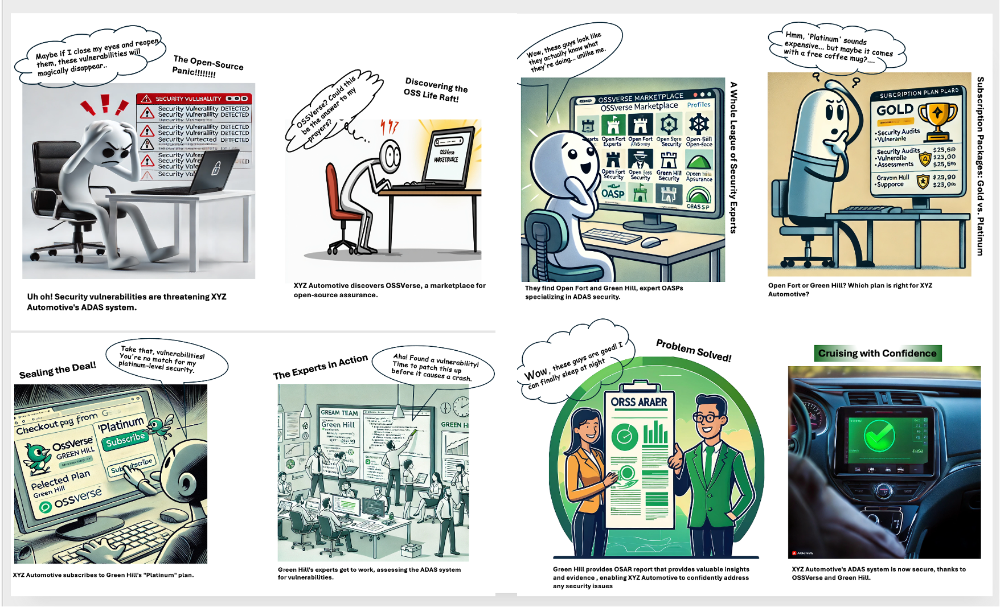

# Concepts

This document introduces the core concepts and frequently asked questions (FAQ) related to the OSSVerse platform and its open-source assurance services.

## OSSVerse in Action: A Visual Story

  

**The Open Source Rescue Squad:**

XYZ Automotive, a leading innovator in the automotive industry, was developing cutting-edge Advanced Driver-Assistance Systems (ADAS) software using open-source components. However, they faced a critical challenge: ensuring the security and reliability of these complex systems.  Their internal teams lacked the specialized expertise to thoroughly assess and secure the open-source codebase, and traditional security solutions were proving inadequate.

They needed a trusted partner, a specialized provider who could understand the nuances of open-source security and deliver tailored solutions for their ADAS software.  But finding the right expertise in the vast and fragmented open-source landscape was like navigating a maze without a map.

Then they discovered OSSVerse, a revolutionary B2B marketplace designed specifically for open-source assurance. OSSVerse connected them with a curated network of vetted OASPs, each offering specialized expertise and a range of assurance services.

Through OSSVerse, XYZ Automotive found Open Fort and Green Hill, two OASPs with a proven track record in ADAS security. After reviewing their services and comparing subscription plans, XYZ Automotive chose Green Hill's "Platinum" plan to get the highest level of assurance for their ADAS system.

Green Hill's team of security experts, equipped with the latest tools and methodologies, conducted comprehensive assessments, identified potential vulnerabilities, and provided detailed reports and recommendations. With this valuable insight, XYZ Automotive could confidently address any security gaps and ensure the safety and reliability of their ADAS system.

OSSVerse empowered XYZ Automotive to find the perfect OASP and secure their open-source software, accelerating their innovation and giving them peace of mind.  By connecting businesses with trusted assurance providers, OSSVerse is driving the future of secure and reliable open-source software in the automotive industry and beyond.

## Frequently Asked Questions (FAQ)

## The OSSVerse Marketplace

**Q: What is OSSVerse, and why is it necessary?**

A: OSSVerse is a pioneering decentralized marketplace designed to address the critical need for trust and transparency in the open-source software (OSS) ecosystem. Organizations often struggle to assess and manage the risks associated with using OSS components, and OSSVerse provides a trusted platform to connect with experts (OASPs) who can help mitigate these risks.
[Explore the OSSVerse Marketplace](https://ossverse.github.io/OSSVerse/)

**Q: How does OSSVerse work?**

A: OSSVerse acts as a bridge between buyers (organizations or developers) and OASPs. Buyers can easily search for and subscribe to assurance services offered by OASPs, while OASPs can showcase their expertise and connect with a wider audience.

**Q: What are the key benefits of using OSSVerse?**

A: OSSVerse offers several advantages:

*  **Curated Network:** Access a network of vetted and qualified OASPs.
*  **Transparency:**  A transparent and competitive environment for comparing services and pricing.
*  **Flexibility:** Choose from subscription plans or one-time services.
*  **Efficiency:** Streamlined process for finding and using assurance services.
*  **Community:**  Engage with a thriving open-source security community.

**Q: What is the technology behind OSSVerse?**

A: OSSVerse is built on the Beckn Protocol, an open standard for decentralized digital commerce. This ensures interoperability, scalability, and security, making it easy for you to connect with OASPs and manage your assurance services.

[Explore Beckn](https://github.com/beckn)

**Q: What is OSSVerse-In-A-Box (OIAB)?**

A: OIAB is a tool that provides a pre-configured OSSVerse marketplace environment for testing and demonstration purposes. It allows users to quickly set up and explore the functionalities of OSSVerse and experiment with different scenarios.

[Explore OSSVerse-In-A-Box (OIAB)](https://github.com/OSSVerse/OSSVerse-In-A-Box)

## Open Source Assurance Services

**Q: What is an OASP?**

A: An OASP (Open Source Assurance Service Provider) is a qualified expert who provides services to help organizations ensure the quality, security, and compliance of their open-source software components.

**Q: What types of services do OASPs offer on OSSVerse?**

A: OSSVerse offers a comprehensive range of open-source assurance services, including:

*   Security Audits & Assessments
*   Vulnerability Detection & Remediation
*   Code Reviews
*   License Compliance Checks
*   Penetration Testing
*   TAVOSS Support

**Q: What are deliverables and evidence?**

A: Deliverables are the tangible outputs produced by OASPs, such as assessment reports. These reports provide detailed findings, recommendations, and supporting evidence to help buyers understand and address any issues identified in their open-source software.

**Q: What is a quotation?**

A: A quotation is a formal proposal outlining the price and terms for a service or set of services offered by an OASP. It includes details about the cost, a breakdown of the services included, and any associated terms and conditions.

##  BeSLab and O31E

**Q: What is BeSLab, and how does it fit into OSSVerse?**

A: BeSLab is a blueprint and platform for setting up secure open-source security labs. It empowers OASPs to deliver exceptional assurance services by providing the tools and automation necessary for efficient and standardized assessments.

## Subscriptions and Pricing

**Q: How does pricing and subscriptions work on OSSVerse?** 

A: OSSVerse primarily operates on a subscription-based model with three tiers: Basic, Gold, and Platinum. Some OASPs also offer ad-hoc services. Pricing varies depending on the OASP and the services included in the subscription plan. Buyers can compare pricing and negotiate quotes directly with OASPs on the platform.

## Service Categorization

**Q: How are services categorized on OSSVerse?**

A: OSSVerse uses a catalog and category system to organize service offerings into a hierarchical structure. This makes it easier for buyers to discover and select the services they need based on their specific requirements.
