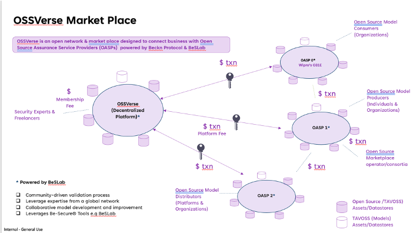

# Shift Into Overdrive: Secure Your Open Source with OSSVerse

Open source is the fuel that drives innovation, allowing businesses to accelerate development and reach new heights. But without proper assurance, hidden vulnerabilities can slam the brakes on your progress.

## The Need for Trust in a High-Speed Open Source World

Open source is a high-performance engine, but trust is the essential key that unlocks its true potential.  Without confidence in the security and integrity of your open-source components, innovation can quickly stall.

Traditional assurance methods struggle to keep pace with the rapid evolution of open source.  Fragmented approaches, inconsistent standards, and time-consuming processes create uncertainty and hinder the adoption of open-source software, especially for businesses with mission-critical applications.

## OSSVerse: Your B2B Open Source Pit Stop

OSSVerse is the **marketplace built for trust** in the open-source ecosystem. We connect **businesses** with a diverse network of **expert Open Source Assurance Service Providers (OASPs)** who can help you navigate the complexities of open source with confidence.

**Fine-Tune Your Open Source Strategy with a Range of Assurance Services**

Our OASPs offer a comprehensive suite of services to optimize your open-source performance:

*   **Security Assessment & Attestation:** A thorough inspection to uncover vulnerabilities and ensure your OSS components are race-ready.
*   **Validation & Verification:**  Expert validation to ensure your open-source components are running smoothly and efficiently.
*   **Open Source Remediation Service:**  Quickly address vulnerabilities and security risks to keep your projects on track.
*   **Red Teaming and Penetration Testing:**  Push your systems to the limit with proactive security testing to identify and address weaknesses before they cause a crash.
*   **Feature Addition:** Enhance your open-source software with custom feature additions to accelerate your development.
*   **TAVOSS Support:** Get expert support for Trusted And Verified Open Source Software (TAVOSS) versions, ensuring long-term reliability and maintainability.

 

**Why Choose OSSVerse?**

*   **Curated Network of OASPs:** We ensure that only qualified and reliable providers join our marketplace.
*   **Transparent and Competitive:** Compare services, pricing, and OASP qualifications with ease.
*   **Flexible Engagement:** Choose from subscription plans or one-time services to suit your needs.
*   **Secure and Efficient:** Beckn protocol integration ensures secure transactions and streamlined communication.
* **Powered by BeSLab:** Our OASPs leverage BeSLab, a cutting-edge platform for automated and standardized open-source assurance. [Learn more about BeSLab](https://be-secure.github.io/BeSLab/)

**Ready to accelerate your innovation with confidence?**

[Explore the OSSVerse Marketplace](https://ossverse.github.io/OSSVerse/)

##  The OSS-assurance-specification: Your Roadmap to Open Source Confidence

To ensure a seamless and trustworthy experience within the OSSVerse marketplace, we've developed the OSS-assurance-specification. This specification defines the Beckn-based APIs and data models that enable efficient and standardized interactions between buyers, the OSSVerse platform, and OASPs.

**Benefits of the OSS-assurance-specification** 

*   **Reduced Vendor Management Overhead:** Managing multiple vendors can be a headache. The specification simplifies vendor management by providing a standardized framework for communication, transactions, and service delivery.
*   **Increased Speed and Efficiency:** Accelerate your open-source adoption and development with streamlined processes for procuring and managing assurance services.
*   **Ease of Buying and Selling:** The specification makes it easier for buyers to find and select the services they need and for OASPs to market and deliver their offerings efficiently.
*   **Leverage Expert Services, Mitigate Risk:** Access a diverse network of OASPs to address your specific security and compliance needs, reducing your risk and increasing confidence in your open-source software.
*   **Community-Driven Maintenance:** Benefit from a vibrant open-source community that actively maintains and updates the specification, ensuring its ongoing relevance and effectiveness.

**The OSS-assurance-specification provides the roadmap for a secure and trustworthy open-source journey:**

*   **Interoperability:**  Ensures seamless communication and data exchange between different platforms, like a well-coordinated pit crew.
*   **Transparency:** Provides clear visibility into the assurance process, building confidence and accountability.
*   **Efficiency:** Streamlines workflows for faster and more cost-effective assurance services.
*   **Trust:**  Establishes a foundation of trust in the quality and security of open-source software, allowing you to accelerate innovation with confidence.

**The OSS-assurance-specification provides a standardized framework for key interactions within the OSSVerse marketplace, including:**

*   **Service discovery and selection.**
Easily find and choose the right assurance services.
*   **Order processing and fulfillment.**
Streamlined order management and efficient service delivery.
*   **Subscription management.**
Flexible subscription options for ongoing assurance.
*   **Negotiation and quotation.**
Transparent pricing and negotiation capabilities.
*   **Support and communication.**
Clear communication channels and dedicated support.