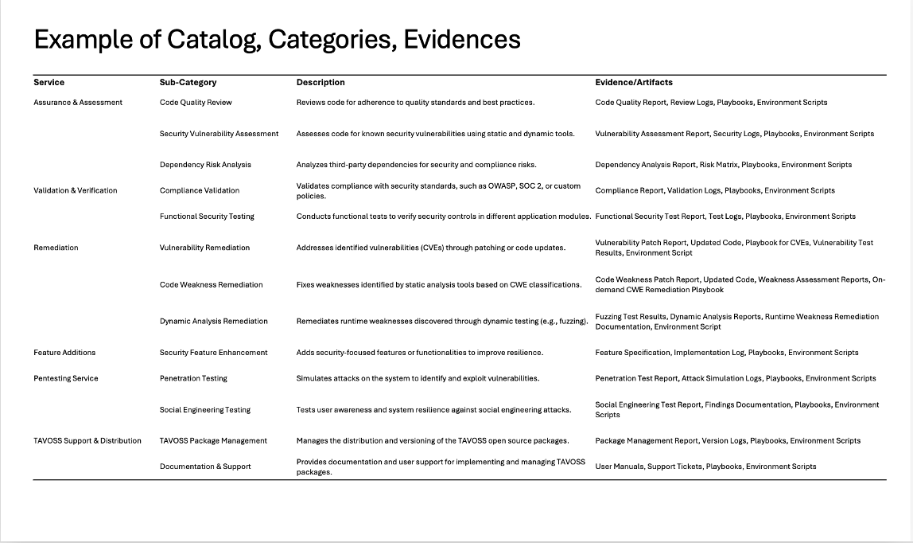

# Schemas: Understanding the Data Models

This section provides an overview of the schemas and data models used in the OSS-assurance-specification. These schemas define the structure of the data exchanged between the Buyer Application Platform (BAP), Beckn Provider Platform (BPP), and Open Source Assurance Service Provider (OASP) during interactions on the OSSVerse platform.

## Schema Summary

### Key Entities in OSSVerse

  

##  Frequently Asked Questions (FAQ)

**Q: Can you explain some of the key entities in the context of the OSSVerse Marketplace?**

A: Some of the core entities that represent the key elements and interactions within the OSSVerse marketplace:

*   **Provider:** Represents any entity offering services on the OSSVerse platform. This includes **OASPs (Open Source Assurance Service Providers)** who offer assurance services for open-source software. The `Provider` entity includes specific fields to capture information relevant to OASPs, such as their subscription plans, past projects, licenses, and expertise.

*   **Item:** Represents the open-source project or software component being assessed. It includes details such as the project's name, version, and repository location.

*   **ServicePackage:** A bundle of specific assurance services offered by an OASP. This defines the scope of services included, the deliverables produced, any usage limits, and the assurance level provided.

*   **SubscriptionPlan:** A plan that defines the pricing, billing period (e.g., monthly, annually), and the included `ServicePackage`s for recurring assurance services. It acts as a template for subscriptions.

*   **Subscription:** Represents an *active subscription* a buyer has to a specific `SubscriptionPlan`. It includes details like the subscription ID, status, start and end dates, and payment information.

*   **Order:** A request for assurance services, either placed within a `Subscription` or as a one-time purchase. It details the requested services, the selected OASP, billing and payment information, and fulfillment details.

*   **Fulfillment:** The process of delivering the assurance services defined in a `ServicePackage` for an `Item` within an `Order`. It includes details about the fulfillment type, status, and timeline.

*   **FulfillmentState:** Represents the different states that a `Fulfillment` can be in (e.g., "PENDING", "IN_PROGRESS", "COMPLETED").

*   **Deliverable:** The tangible output or report produced as a result of the assurance service. This could be a security audit report, a vulnerability assessment document, or a code review summary.

*   **Quotation:** A proposed price and terms for a `ServicePackage` or a set of services. It may include a breakdown of costs and any terms and conditions.

*   **Evidence:** Information or artifacts that support the claims made in an assessment or quotation. This could include test results, code snippets, or certifications.

*   **Certificate:**  A credential that indicates compliance with specific standards or qualifications relevant to open-source assurance.

*   **Artifact:** Any tangible by-product of the assessment process, such as tools, scripts, or remediation guides, that might be included as part of the `Evidence` or `Deliverable`. 

*   **SLA (Service Level Agreement):** Defines the service level agreement between the OASP and the buyer, outlining expectations for service delivery, response times, and support.

*   **License:** Represents a license granted to an OASP to operate within OSSVerse and provide specific types of assurance services. This could include details about the scope of the license, its validity period, and any associated terms and conditions.

*   **AddOn:** Represents an optional add-on service or product that can be included in an order or subscription to enhance the core offering. This could include things like priority support, additional testing, or expedited delivery.

*   **Category:** Represents a classification or grouping of services offered on the OSSVerse marketplace. Categories help buyers navigate the available services and find what they need more easily.

*   **Catalog:** A collection of services offered by a specific provider (OASP) or a curated list of services from multiple providers, organized by categories.

**Q: What is the difference between `intent` and `context`?**

A: In the Beckn protocol, `intent` represents the buyer's specific desire or goal within a transaction (e.g., searching for a service, placing an order). `context` provides background information about the API call itself, such as timestamps, location, and participating entities.

**Q: Can you give an example(s) of `Category`, `Catalog`, and `Evidence`?**

A:
  

**Q: Can you give examples of services, their deliverables, and the units of those?**

A:

  

**Q: What is the difference between `/subscribe` and `/init`?**

A: `/subscribe` is used to initiate a subscription to a service plan, while `/init` is used to initiate the fulfillment of a specific order (which might be part of a subscription or a one-time purchase).
  

**Q: How does OSSVerse handle negotiable and non-negotiable quotes?**

A: OSSVerse allows for flexibility in pricing and negotiation. When a buyer selects a service, the OASP responds with a quote that includes a field called `is_negotiable`.

*  **Negotiable Quotes:** If `is_negotiable` is set to `true`, the buyer can submit a counter-offer using the `/update` API to initiate a negotiation process.
*  **Non-Negotiable Quotes:** If `is_negotiable` is set to `false`, the buyer cannot submit a counter-offer. They can still use the `/update` API to modify other aspects of the order, but any changes to the quote will be ignored or rejected.

This clear indication of negotiability allows buyers to understand the pricing model and make informed decisions.
